# CoursePilot

一门网课三小时，真正能记住的有多少？

CoursePilot 就是为这个问题而生的。它帮你把课程视频变成**可搜索、可复习、可继续加工**的学习资料——字幕、章节、笔记、摘要、课件截图、文字识别、脑图、练习题，还能直接对着课程内容提问。

不管是 B 站上的公开课、学校的录屏回放，还是硬盘里囤了好久的培训视频，丢进来就能用。

官网：[https://wansui976.github.io/CoursePilot/](https://wansui976.github.io/CoursePilot/)

---

## 它能做什么

**整理你的课程库** — 按课程文件夹归类视频，支持直接导入本地文件，也能粘一个 B 站链接自动下载。视频可以拖拽排序，支持批量导入本地文件夹和 B 站播放列表/合集。

**听写字幕** — 本地用 whisper.cpp 就能跑，嫌效果不够好可以切到火山引擎或阿里云的云端识别，识别完还会自动纠错——口头禅、错别字、吞字都帮你清理。云端识别支持断点续跑，中断后不用从头来。如果你手动改了字幕，基于旧稿生成的笔记、章节等 AI 产物会自动标为「已过期」，提醒你重新生成。

**一键生成学习资料** — 章节划分、内容概览、笔记、练习题、脑图，全是大模型根据字幕自动生成的，你也可以随时手动编辑。课件上的文字（板书、公式、定义）也会被识别出来，和讲稿一起喂给 AI——写在片子上但没念出来的内容不会再丢失。

**课件截取和文字识别** — 自动按画面变化比例判断换页，截取动画稳定后的那一帧，跳过纯色页和转场。截图上的文字整批 OCR 识别（本地 tesseract 或阿里云 OCR 都行），导入时自动和语音识别并行处理。提取过程支持硬件解码采样和并发截图，还会先裁掉视频自带的黑边。

**对课程提问** — 单个视频的问答按相关性检索上下文，不用把整份字幕都塞进去；课程级问答可以跨视频提问，两段式重排挑出最相关的段落。回答带 `[mm:ss]` 出处，点一下就跳到对应位置。在文稿里选中一段文字也能直接追问，上下文自动带上。问句搜不到东西时，会自动改写问题再试一次。

**AI 助手** — 屏幕角落的悬浮球，点开就是一个能帮你操作应用的 AI 助手。它可以帮你搜 B 站找视频、新建和管理课程、跳转到指定视频、查看学习进度和待复习内容、分析薄弱知识点——用自然语言说就行，不用自己翻菜单。对话以气泡流显示，工具调用的过程用大白话解释，面板支持拖拽吸附和拉宽。

**学习仪表盘** — 首页展示学习热力图、每门课的完成度和到期复习角标、「继续学习」入口，以及按复习表现聚合出的薄弱主题。可以设每日学习目标，达成后有反馈，桌面端还支持原生学习提醒。

**间隔复习** — 内置 FSRS-4.5 调度器，复习卡按知识点分组。打分前就能看到四个档位分别会把下次复习推到多久之后。在文稿里划一段就能做成挖空卡，也可以手动建卡。

**知识点** — 每个视频自动用大模型抽取知识点，同名和近义的会自动合并，汇聚成课程的知识点清单。知识点页面有解释、AI 问答、学习进度、搜索高亮和补卡入口，按讲课顺序排列。

**全文搜索** — 字幕和课件文字都能搜。课程级搜索可以跨视频命中并直接跳到对应时刻；搜课件文字时还会给出页面缩略图和页码。中文搜索按二字组切词并按稀有度加权，自然语言问句也能命中。

**播放器** — 跳停顿：自动跃过老师写板书、等记笔记这类无声空档，有「上一处/下一处」试跳按钮。智能倍速：按信息密度动态调速——讲得稀的段落自动加速，推导密集处回到你选的倍速，永远不会比你选的更慢。收藏片段：两次点击框出一段，记个笔记，随时跳回。方向键长按进入快扫，短按 ±5 秒。字幕浮层可在画面内自由拖动。

**后台排队处理** — 视频导入后会自动依次走完所有步骤，进度实时显示，随时能暂停，失败了可以单独续跑。

**跨设备同步** — 通过 Apple CloudKit 在多台设备间同步学习记录，支持七种记录类型的合并，网络不好时自动驻留重试。

**回收站** — 删错了？没关系，先去回收站捞回来。按课程分组、带缩略图，支持批量恢复和清除。

**导出** — 字幕（SRT / VTT）、笔记、脑图、练习题，都能导出带走。

**Token 用量** — 每次大模型调用的 token 消耗都有记录，缓存命中率和思考消耗一目了然，帮你掌握 API 花费。

## 截图

| 课程问答 | 文稿搜索 | 脑图 |
| --- | --- | --- |
| 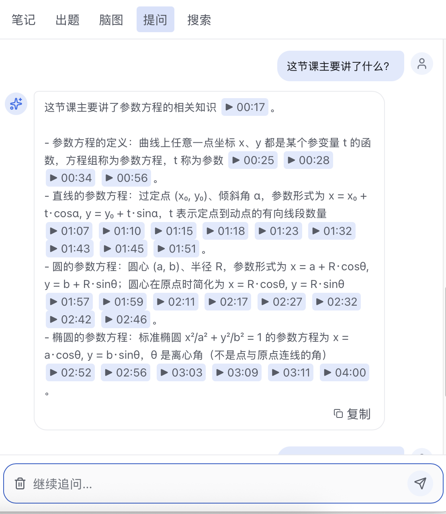 | 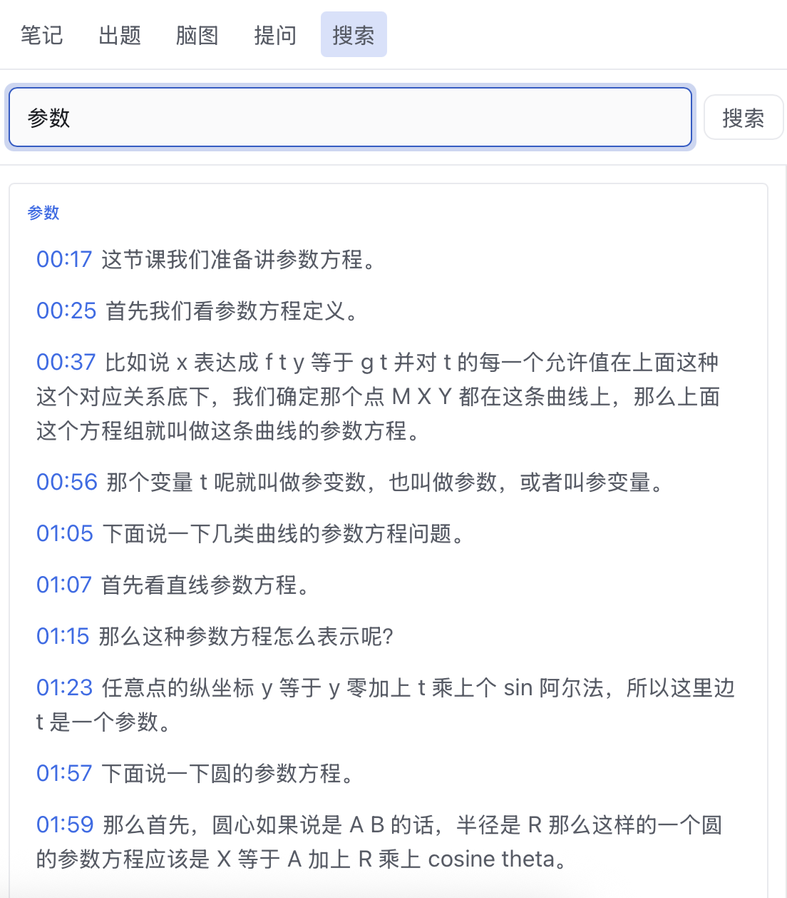 | 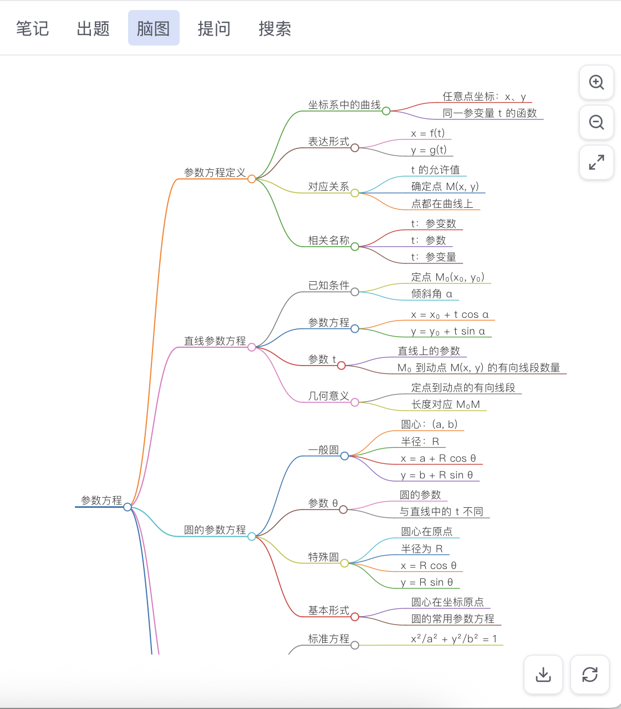 |

| 练习题 | 笔记 | AI 概览 |
| --- | --- | --- |
| 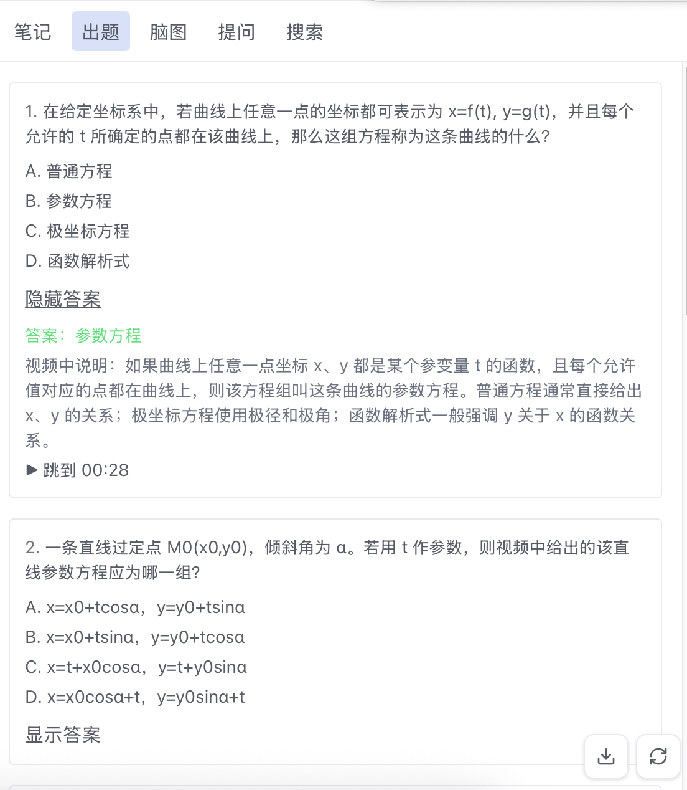 | 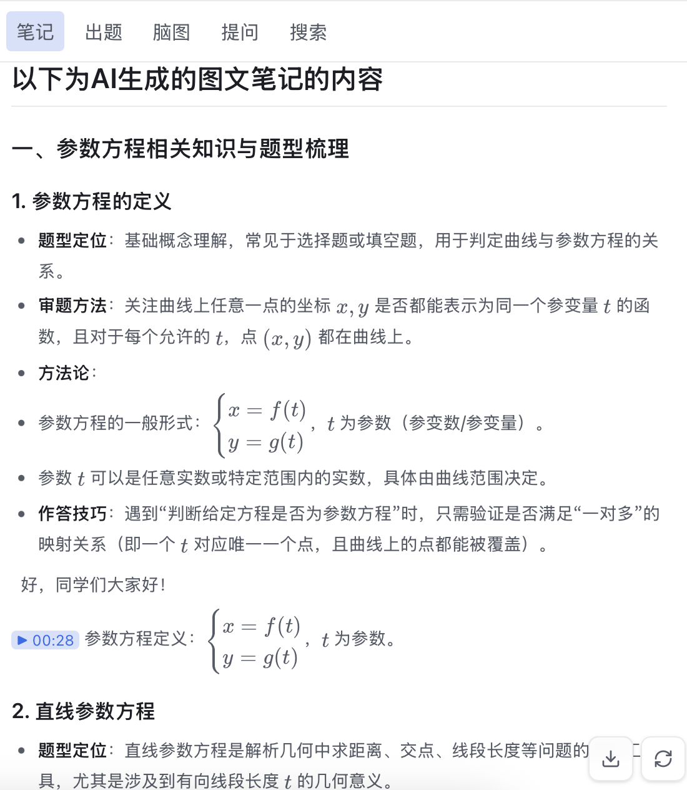 | 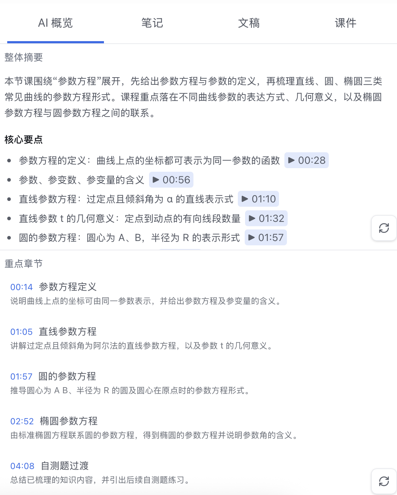 |

| 文稿阅读 |
| --- |
| 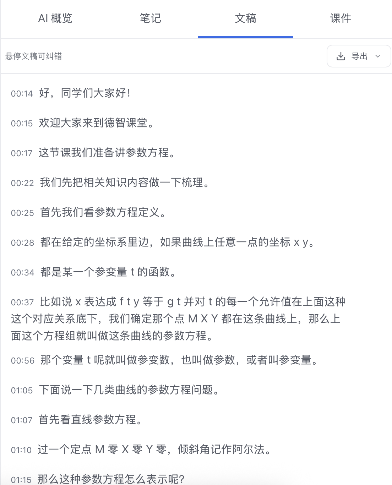 |

| 视频学习工作台 | 课程库 |
| --- | --- |
| 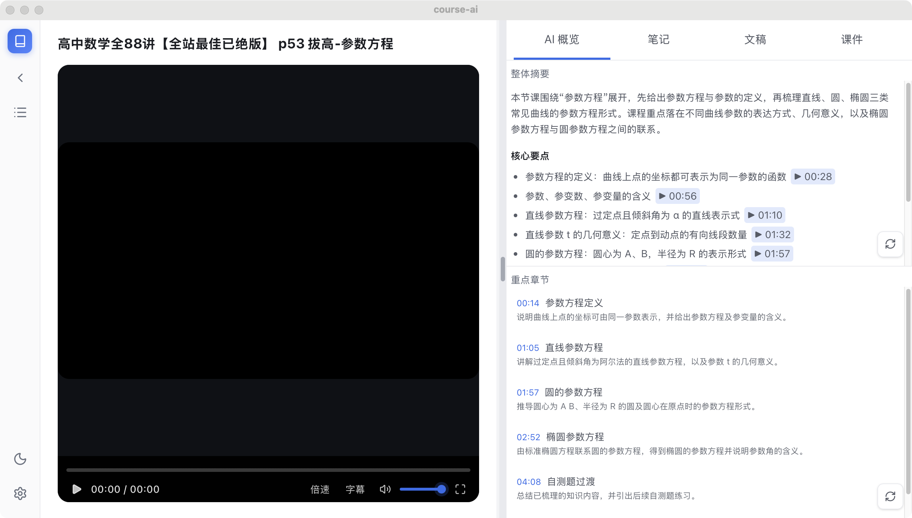 | 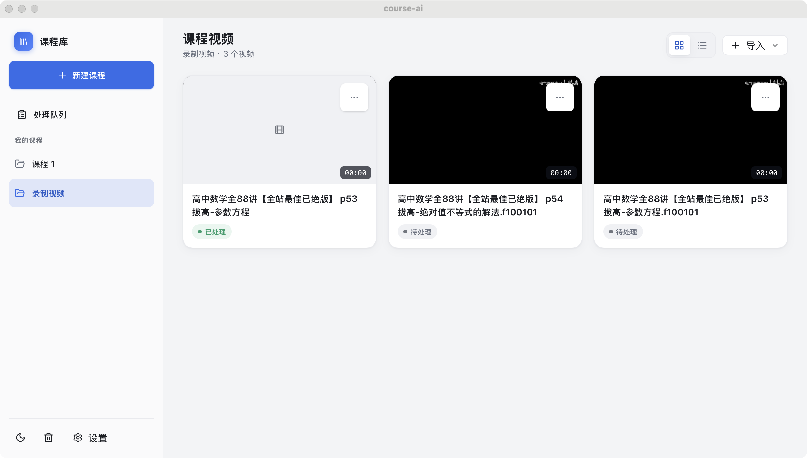 |

| 语音识别设置 | 大模型设置 |
| --- | --- |
| 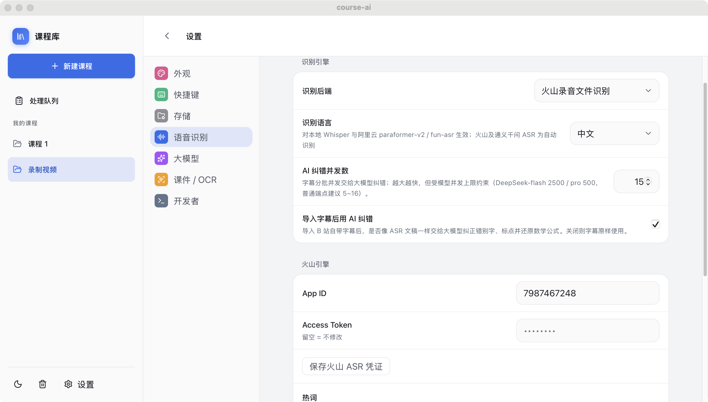 | 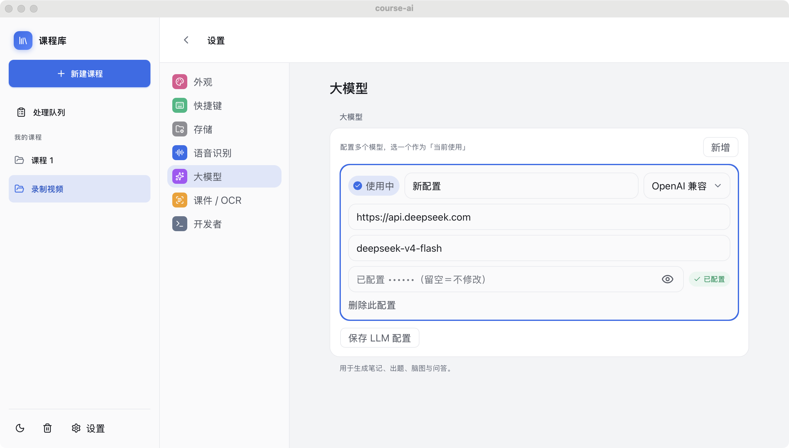 |

---

## 视频导入后会经历什么

导入一个视频后，CoursePilot 会自动走完一条流水线，每一步在「处理队列」里都能看到进度：

```
导入 → 抽取音频 → 语音识别 → 字幕纠错 → 章节 → 概览 → 笔记 → 练习题 → 脑图
       ↘ 课件提取 → 整批 OCR ↗
```

语音识别和课件提取是并行的，不用等一个跑完再跑另一个。中间任何一步失败了，可以单独重跑，不用从头来。

---

## 哪些平台能用

| 能力 | 桌面（macOS） | 移动端（iOS / Android） |
| --- | --- | --- |
| 音频抽取 / 课件截取 / 截图 | ffmpeg | 原生 AVFoundation / MediaMetadataRetriever |
| 本地语音识别 | whisper.cpp | 走云端识别 |
| 网络视频下载 | yt-dlp | 暂时只能导入本地文件 |
| 本地 OCR | tesseract | 走阿里云 OCR |
| 密钥存储 | 系统钥匙串 | 系统钥匙串 |
| 跨设备同步 | Apple CloudKit | Apple CloudKit |

---

## 你的数据在哪

- 所有学习资料（数据库、字幕、课件图、笔记）都保存在**你自己的设备上**。
- 用到云端语音识别、大模型、OCR 时，走的是**你自己的 API Key**，密钥存在系统钥匙串里，不经过任何第三方中转。
- 只做本地转写、课件抽取、本地 OCR 的话，可以**完全断网**使用。

---

## 技术栈

- **桌面框架**：Tauri 2
- **前端**：React 19、TypeScript、Vite、Tailwind CSS
- **后端**：Rust、SQLite、sqlx
- **媒体处理**：ffmpeg、whisper.cpp、yt-dlp、tesseract
- **AI 接入**：OpenAI-compatible（DeepSeek、Anthropic 等均可）、火山 ASR、阿里云 DashScope
- **复习算法**：FSRS-4.5

## 目录结构

```text
.
├── course-ai/              # Tauri 应用主体
│   ├── src/                # React 前端
│   └── src-tauri/          # Rust 后端与桌面壳
├── docs/                   # 设计文档与实施计划
├── LICENSE
└── README.md
```

---

## 开始使用

### 安装依赖

macOS 用户先装这几个工具：

```bash
brew install ffmpeg whisper-cpp tesseract yt-dlp
```

| 工具 | 干什么用 |
| --- | --- |
| `ffmpeg` | 抽音频、截课件、处理视频 |
| `whisper-cli` | 本地语音识别 |
| `tesseract` | 本地 OCR |
| `yt-dlp` | 下载 B 站等网络视频 |

> 如果你直接用 release 安装包，这些依赖已经内置，不用单独装。

另外需要 Node.js 20+、pnpm、Rust stable，以及 Tauri 要求的系统依赖。

### 本地开发

```bash
cd course-ai
pnpm install
pnpm tauri dev
```

### 跑测试

```bash
pnpm test
cd src-tauri && cargo test
```

### 构建前端

```bash
pnpm build
```

---

## 第一次打开，先做这几件事

1. **确认工具已就位** — 至少要有 `ffmpeg` 和 `whisper-cli`。用 release 安装包的话可以跳过这步。

2. **准备你的课程视频** — 本地文件直接拖进来；B 站链接粘贴即可（需要上传 cookies 才能下载）。

3. **决定要不要联网** —
   - 纯离线也能用：本地转写 + 课件抽取 + 本地 OCR，不需要任何 API Key。不过说实话，本地语音识别效果比云端差不少，建议有条件就用云端。
   - 想要 AI 生成摘要、章节、笔记、练习题、脑图、课程问答？先去 **设置 → 大模型** 配一个 LLM Profile 和 API Key。

4. **配语音识别** —
   - 本地：直接用 whisper.cpp，开箱即用。
   - 云端：去 **设置 → 语音识别**，配火山引擎或阿里云 DashScope。

5. **配 OCR（可选）** —
   - 默认用本地 tesseract，够用了。
   - 想要更好的识别效果，去 **设置 → 图文识别 (OCR)** 切到阿里云 OCR。

---

## 典型的使用流程

1. **建课程** — 打开应用，在左侧新建一个课程文件夹。也可以直接问 AI 助手「帮我建一个叫 XX 的课程」。
2. **导入视频** — 点「导入」，上传本地视频、粘贴 B 站链接，或者批量导入一个文件夹/播放列表。
3. **等它处理** — 应用会自动抽音频、跑语音识别、抽取课件、生成章节和笔记，进度全程可见。
4. **开始学习** —
   - 看 **AI 概览** 了解整体脉络
   - 读 **笔记** 或 **脑图** 巩固要点
   - 翻 **文稿** 对着时间戳精读，点一下就跳到视频对应位置
   - 看 **课件** 页面截图，截字做 OCR
   - 浏览 **知识点** 清单，看看这节课讲了哪些概念
5. **深入学习** — 对课程内容提问、在文稿里选中一段直接追问、搜索关键词、截图插进笔记、导出资料。
6. **复习巩固** — 做练习题，用间隔复习卡片巩固知识点，在学习仪表盘看看自己哪里薄弱。

---

## 几个容易踩的坑

- **没配大模型就用不了 AI 功能** — 章节、摘要、笔记、问答这些都需要先在 **设置 → 大模型** 里填好 API Key。
- **课程问答不需要 embeddings** — 它是把字幕直接喂给大模型的，不用额外配向量数据库。文稿搜索也是本地关键词匹配，不需要任何额外配置。
- **阿里云 OCR 和 ASR 的凭证不一样** — OCR 用的是 AccessKey ID / Secret，DashScope 语音识别用的是 API Key，两套东西别搞混了。

---

## 云端服务怎么配

### 火山引擎语音识别

先去火山引擎控制台开通[录音文件识别大模型版](https://console.volcengine.com/speech/service/10012)，拿到 App ID 和 Access Token，填进应用设置即可。

### DeepSeek

1. 去 [DeepSeek Platform](https://platform.deepseek.com/) 注册，申请一个 API Key。
2. 余额不足的话先充点钱。
3. 打开应用 **设置 → 大模型**，新建一个 OpenAI-compatible Profile：
   - **Base URL**：`https://api.deepseek.com`
   - **API Key**：填你的 DeepSeek Key
   - **Model**：填你要用的模型名

> DeepSeek 的接口兼容 OpenAI 格式，所以在 CoursePilot 里选 OpenAI-compatible 就行。

### 阿里云 OCR

应用的「截字」默认用本地 tesseract，想要更好的效果可以切到阿里云 OCR：

1. 用阿里云账号登录[文字识别 OCR 控制台](https://ocr.console.aliyun.com/overview)，开通服务（新用户通常有免费额度）。
2. 去 [AccessKey 管理页](https://ram.console.aliyun.com/profile/access-keys) 创建 AccessKey。创建时会**一次性**显示 Secret，记得保存。
   - 安全起见，建议在 [RAM 控制台](https://ram.console.aliyun.com/users) 建一个子用户，给 `AliyunOCRFullAccess` 权限，用子用户的 Key。
3. 打开应用 **设置 → 图文识别 (OCR)**，切到「阿里云 OCR 统一识别」，填好凭证，保存。

> 再强调一次：阿里云 OCR 的 AccessKey 和 DashScope 的 API Key 是两套不同的东西，不要混用。

---

## License

MIT
