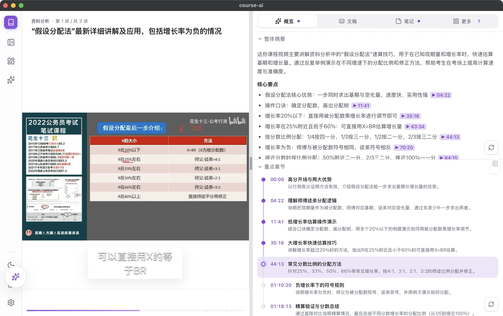
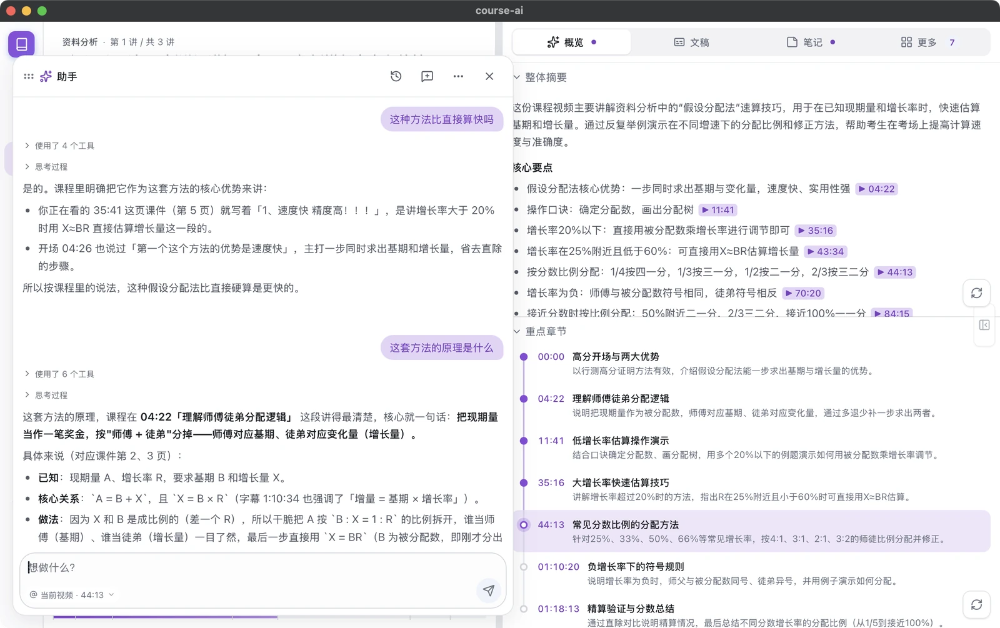
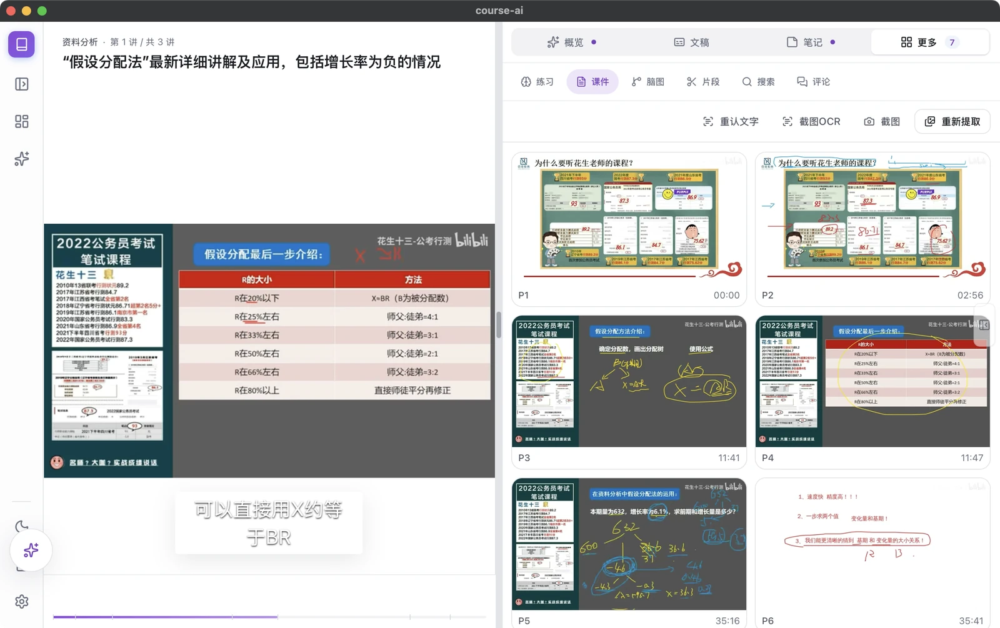
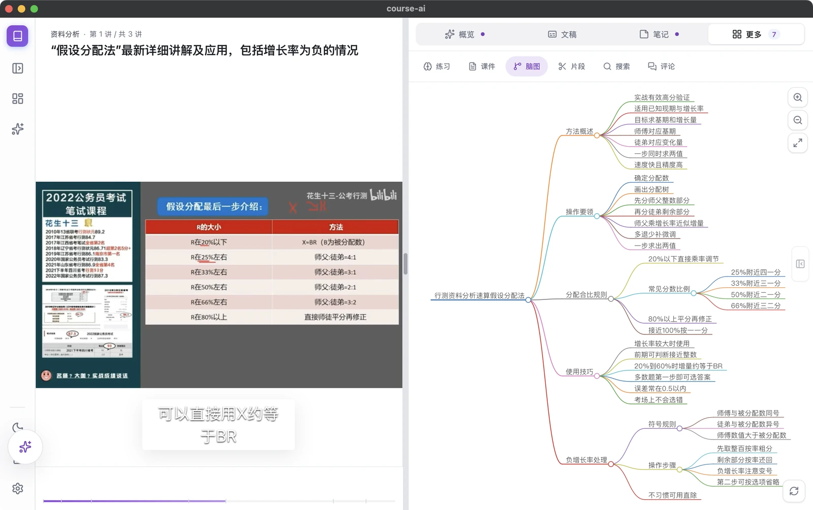
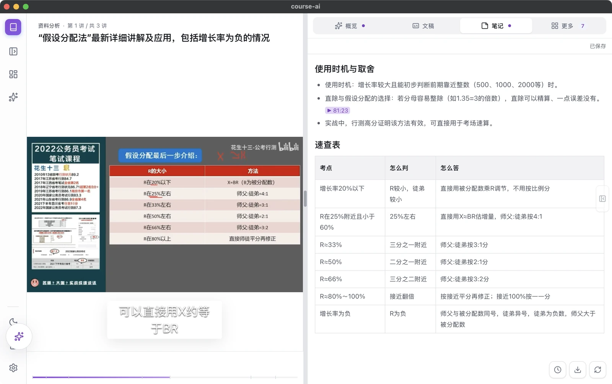
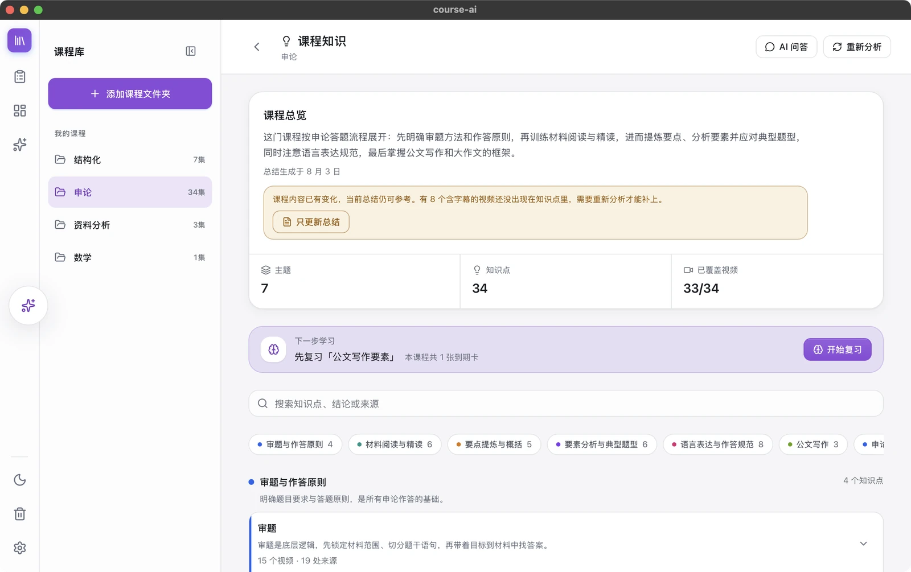
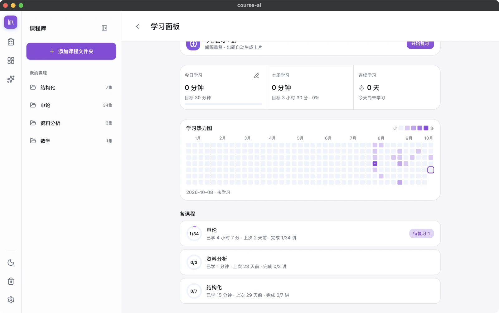
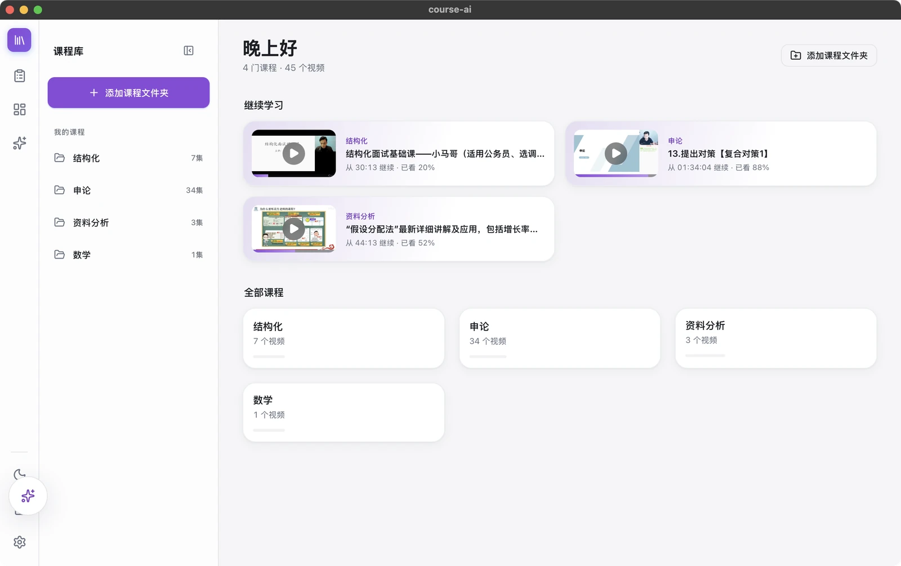
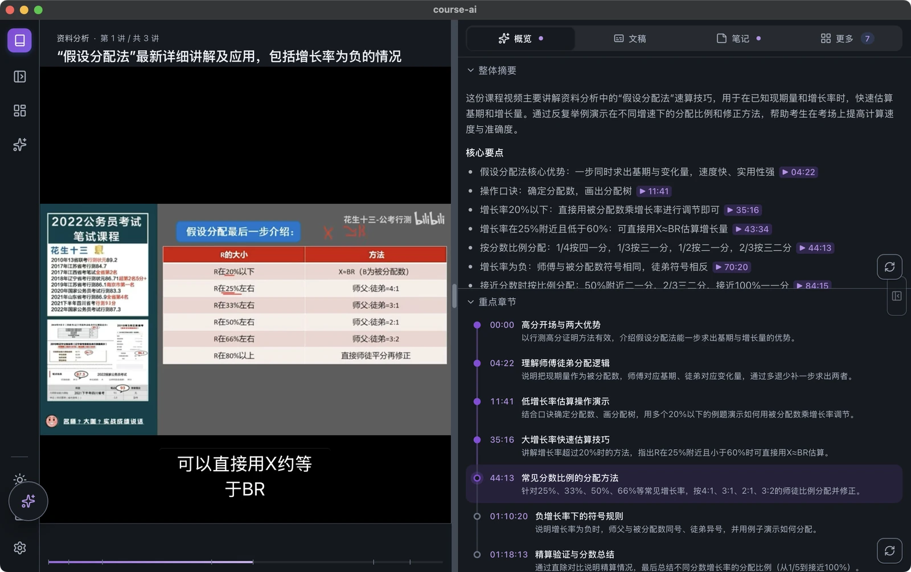

<div align="center">


# CoursePilot

**Turn course videos into something you actually remember.**

An open-source, local-first AI study workbench for video courses. Drop in a lecture and get back<br>
transcripts, notes, mind maps, slide OCR, quizzes, cited Q&A, and spaced repetition.

[](https://github.com/wansui976/CoursePilot/releases/latest)
[](https://github.com/wansui976/CoursePilot/releases)
[](https://github.com/wansui976/CoursePilot/stargazers)
[](./LICENSE)


[**⬇️ Download**](https://github.com/wansui976/CoursePilot/releases/latest) · [**🌐 Website**](https://wansui976.github.io/CoursePilot/) · [中文](./README.md) · [Report an issue](https://github.com/wansui976/CoursePilot/issues)

</div>

<p align="center">
  
</p>

A three-hour lecture — how much do you actually remember?

CoursePilot exists to fix that. Whether it's a public course on Bilibili, a recorded class, or training videos sitting on your drive, drop them in and CoursePilot runs the whole pipeline: transcribe → correct → organize → quiz. Then knowledge points and spaced repetition help you make it stick.

> The app ships with both Chinese and English UIs (**Settings → Appearance → Language**). The screenshots below show the Chinese UI.

## ✨ Highlights

- 🎬 **One lecture, a full study kit** — chapters, overview, illustrated notes, mind map, quiz, and knowledge points, all generated automatically, editable, and exportable.
- 🖼️ **Slides included** — detects page turns, captures every slide, and OCRs it, so formulas and definitions that are shown but never spoken still reach the AI.
- 💬 **Answers with sources** — ask about one video or a whole course; answers cite `[mm:ss]` timestamps and slide pages you can click to jump back.
- 🧠 **Built for retention** — FSRS-4.5 spaced repetition, knowledge points merged across videos, a study heatmap, and weak-topic analysis.
- 🤖 **Run the app in plain language** — the AI assistant searches Bilibili, creates courses, checks your progress, and turns a chat into notes. It asks before changing anything.
- 📺 **Bilibili-friendly** — paste a link to download, batch-import playlists or collections, keep the danmaku and comment threads, and follow collections so new videos import themselves.
- 🌍 **Beyond Bilibili** — YouTube, podcast links and local audio (mp3, m4a…) work too, and foreign-language lectures get one-click translated, bilingual subtitles.
- 📤 **Made to share** — export a slide-by-slide handout as PDF, and turn notes, mind maps or your study week into share-ready images.
- 🔒 **Your data stays yours** — everything lives on your device and uses your own API keys (stored in the system keychain). It runs fully offline with local transcription and OCR.

## 🆕 New in v0.3.0

- **Danmaku heat curve** — danmaku density drawn above the progress bar, with clickable dots on the busiest moments.
- **Lecture handouts** — every slide with the key points said while it was on screen, grouped by chapter, ready to save as PDF from your browser.
- **Share images** — notes, mind maps and a weekly study report as 1080px-wide images.
- **Translated, bilingual subtitles** — translate into Chinese, English, Japanese or Korean, then switch the player between original, bilingual and translated.
- **Follow collections** — tick “follow” when importing a playlist; the app checks every 6 hours and imports and processes new videos.
- **More sources** — YouTube and podcast links no longer ask for Bilibili cookies; local audio files import directly (slide extraction is skipped).
- **Better formulas** — slide OCR, notes, summaries and quizzes write formulas as LaTeX and render them.

## 📸 Screenshots

<table>
  <tr>
    <td width="50%"><b>Ask about the lecture, get cited answers</b><br></td>
    <td width="50%"><b>Automatic slide capture + batch OCR</b><br></td>
  </tr>
  <tr>
    <td><b>Mind map</b><br></td>
    <td><b>Illustrated notes with a cheat sheet</b><br></td>
  </tr>
  <tr>
    <td><b>Quizzes that feed spaced repetition</b><br></td>
    <td><b>Editable, searchable transcript</b><br></td>
  </tr>
  <tr>
    <td><b>Course knowledge across videos</b><br></td>
    <td><b>Dashboard: heatmap and course progress</b><br></td>
  </tr>
  <tr>
    <td><b>Course library</b><br></td>
    <td><b>Dark mode</b><br></td>
  </tr>
</table>

<sub>The course in the screenshots is a public Bilibili course (花生十三 · data analysis); everything shown was generated by CoursePilot.</sub>

## 🚀 Download

| Platform | Installer | Notes |
| --- | --- | --- |
| macOS (Apple Silicon) | [`.dmg`](https://github.com/wansui976/CoursePilot/releases/latest) | ffmpeg, whisper.cpp, etc. bundled |
| Windows (x64) | [`.exe` / `.msi`](https://github.com/wansui976/CoursePilot/releases/latest) | Dependencies bundled |
| iOS / iPadOS / Android | Coming soon | Build from source to try it now |

> [!NOTE]
> The installers aren't signed yet. If macOS says the app "is damaged and can't be opened", run `xattr -cr /Applications/course-ai.app` and open it again. If Windows SmartScreen warns you, click **More info → Run anyway**.

### First run in three steps

1. **Create a course and import videos** — drag in local files or paste a Bilibili link (downloads need a cookies file uploaded in Settings). You can also batch-import a folder or a whole playlist.
2. **Add an LLM** — in **Settings → LLM**, add any OpenAI-compatible API key (DeepSeek works). That unlocks every AI feature. Without one, local transcription, slide extraction, and OCR still work offline.
3. **Let it process, then study** — skim the AI overview → read the notes and mind map → go through the transcript → ask questions → take the quiz and start spaced repetition.

<details>
<summary><b>Want better recognition?</b> (cloud ASR / OCR)</summary>

- **Speech recognition**: local whisper.cpp works out of the box but is noticeably weaker than cloud ASR. Set up Volcengine or Alibaba DashScope in **Settings → Speech Recognition** (see "Cloud services" below).
- **OCR**: local tesseract by default. For dense slides, switch to Alibaba Cloud OCR or the DeepSeek vision model in **Settings → Slides / OCR**.

</details>

---

## 🧩 Features

### Import & processing

- **Course library** — organize videos into course folders with drag-and-drop ordering. Import local video or audio, Bilibili / YouTube / podcast links, or batch-import folders and playlists/collections.
- **Followed collections** — follow a playlist while importing it; new videos are imported and processed automatically (up to 3 per check, preferring built-in subtitles). Manage them under “Subscriptions” in the course menu.
- **Background queue** — every imported video runs through all steps automatically, with live progress. Pause anytime; retry just the failed step.
- **Transcription** — local whisper.cpp or cloud ASR (Volcengine, Alibaba). An LLM then cleans up filler words, typos, and swallowed syllables. Cloud ASR resumes from checkpoints. If you edit a transcript, materials generated from the old version are marked outdated.
- **Slide extraction & OCR** — detects page turns by frame-difference ratio, captures the stable frame after animations, skips solid-color and transition frames, and crops black bars first. Batch OCR runs through local tesseract, Alibaba Cloud OCR, or the DeepSeek vision model, in parallel with speech recognition.

### AI study materials

- **One-click generation** — chapters, overview, notes, quizzes, and mind maps, generated from the transcript plus slide text. All editable.
- **Knowledge points** — extracted from every video, with duplicates and synonyms merged into a course-wide list. Each point gets an explanation, AI Q&A, progress tracking, and a shortcut to add flashcards.
- **Full-text search** — searches transcripts and slide text across videos and jumps straight to the moment. Chinese search uses bigram tokenization weighted by rarity, so natural-language questions match too.
- **Subtitle translation** — your LLM translates subtitles into Chinese, English, Japanese or Korean, aligned line by line; after edits only the changed lines are re-translated.
- **Formulas** — slide OCR (DeepSeek vision), notes, summaries and quizzes write formulas as LaTeX, rendered with KaTeX.
- **Handouts** — each slide with the key points said during it (transcript excerpts without an LLM), grouped by chapter, one click from PDF.
- **Share images** — notes, mind maps and weekly study reports with the course and lecture title.
- **Export** — subtitles (SRT / VTT), notes, mind maps, and quizzes.

### Q&A and the AI assistant

- **Ask the course** — single-video Q&A retrieves only the relevant context; course-level Q&A works across videos with two-stage reranking. Select transcript text to ask a follow-up. If retrieval finds nothing, the question is rewritten and retried.
- **AI assistant** — a floating button that operates the app for you: search Bilibili, create and manage courses, jump to videos, check progress and due reviews, analyze weak spots, and turn a conversation into notes. Changes to your data require a confirmation card first. Tool calls are explained in plain language and labeled running / succeeded / failed / cancelled. Conversations persist across restarts.

### Retention loop

- **Spaced repetition** — a built-in FSRS-4.5 scheduler with cards grouped by knowledge point. Before you rate a card you can see when each of the four ratings would schedule it. Highlight transcript text to make a cloze card.
- **Dashboard** — study heatmap, per-course completion, due-review badges, a continue-learning entry, and weak topics. Set a daily goal; desktop builds support native study reminders.

### Player

- **Skip silence** — jumps over quiet gaps while the teacher writes on the board.
- **Smart speed** — adapts playback speed to information density and never drops below the speed you picked.
- **Clips** — mark a range with two clicks, attach a note, and jump back anytime.
- **Bilibili danmaku & comments** — fetched in the background and cached locally. Toggle the danmaku layer anytime; the comment panel keeps nested replies, avatars, and emotes.
- **Danmaku heat curve** — danmaku density above the progress bar with clickable peaks; opening and sign-off bursts are ignored.
- **Bilingual subtitles** — translated lectures switch between original, bilingual and translated captions.
- Hold the arrow keys to scrub, tap for ±5s; the subtitle overlay can be dragged and resized.

### Data & safety

- **Cross-device sync** — Apple CloudKit syncs study records between Mac, iPhone, and iPad, retrying automatically on bad networks.
- **Backup & recycle bin** — one-click backup/restore of the whole database plus a daily automatic snapshot. Deleted items go to a recycle bin first and can be restored in bulk.
- **Token usage** — every LLM call is logged with token counts, cache-hit rate, and reasoning tokens.

## ⚙️ The processing pipeline

```
Import → Extract audio → ASR → Transcript correction → Chapters → Overview → Notes → Quiz → Mind map
         ↘ Slide extraction → Batch OCR ↗
```

ASR and slide extraction run in parallel. Each step's progress shows in the processing queue, and any failed step can be rerun on its own.

## 🆚 How is this different from online "AI video summary" tools?

| | Online summarizers | CoursePilot |
| --- | --- | --- |
| Where your data lives | Their servers | Your device |
| Cost | Subscription | Free and open source; you pay only for your own API usage |
| Slides / board writing | Usually transcript only | Captures and OCRs slides for the AI |
| After you watch | A summary | Quizzes, knowledge points, FSRS repetition, and a dashboard |
| Local videos | Usually need uploading | Imported directly; can be processed fully offline |

## 🖥️ Platform support

| Capability | Desktop (macOS / Windows) | Mobile (iOS / Android) |
| --- | --- | --- |
| Audio extraction / slide capture | ffmpeg | Native AVFoundation / MediaMetadataRetriever |
| Local ASR | whisper.cpp | Cloud ASR |
| Online video download | yt-dlp | Local files only for now |
| Local OCR | tesseract | Cloud OCR (Alibaba / DeepSeek) |
| Key storage | macOS Keychain / Windows Credential Manager | System keychain |
| Cross-device sync | macOS (Apple CloudKit) | iOS (Apple CloudKit) |

## 🔒 Where your data lives

- All study materials (database, transcripts, slide images, notes) are stored **on your own device**.
- Cloud ASR, LLM, and OCR calls use **your own API keys**. They're kept in the system keychain, can't be read back from the UI, and never pass through a third-party relay.
- With local transcription, slide extraction, and local OCR only, CoursePilot runs **fully offline**.

---

## 🛠️ Build from source

**Stack**: Tauri 2 · React 19 + TypeScript + Vite + Tailwind CSS · Rust + SQLite (sqlx) · ffmpeg / whisper.cpp / yt-dlp / tesseract · FSRS-4.5

You'll need Node.js 20+, pnpm, Rust stable, and Tauri's system prerequisites. On macOS, install the media tools first:

```bash
brew install ffmpeg whisper-cpp tesseract yt-dlp
```

```bash
cd course-ai
pnpm install
pnpm tauri dev               # run in development
pnpm test                    # frontend tests
cd src-tauri && cargo test   # backend tests
```

```text
.
├── course-ai/          # Tauri app
│   ├── src/            # React frontend
│   └── src-tauri/      # Rust backend & desktop shell
├── website/            # Website (GitHub Pages)
└── docs/               # Design docs & implementation plans
```

## ☁️ Cloud services

<details>
<summary><b>DeepSeek (LLM)</b></summary>

1. Sign up at [DeepSeek Platform](https://platform.deepseek.com/), create an API key, and top up if needed.
2. In **Settings → LLM**, create an OpenAI-compatible profile:
   - **Base URL**: `https://api.deepseek.com`
   - **API Key**: your DeepSeek key
   - **Model**: the model you want

Any other OpenAI-compatible service is set up the same way.

</details>

<details>
<summary><b>Volcengine (speech recognition)</b></summary>

Enable [audio file recognition (large model)](https://console.volcengine.com/speech/service/10012) in the Volcengine console, then enter the App ID and Access Token in **Settings → Speech Recognition**.

</details>

<details>
<summary><b>DeepSeek vision (OCR)</b></summary>

In **Settings → Slides / OCR**, choose "DeepSeek Vision (AI)" and fill in the Base URL (default `https://api.deepseek.com`), the model (default `deepseek-v4-flash-vision-exp`), and an API key. This key is stored separately from your LLM profile keys.

</details>

<details>
<summary><b>Alibaba Cloud OCR</b></summary>

1. Enable the service in the [OCR console](https://ocr.console.aliyun.com/overview) (new accounts usually get a free quota).
2. Create an AccessKey on the [AccessKey page](https://ram.console.aliyun.com/profile/access-keys). The secret is shown only once, so save it. For safety, create a sub-user in the [RAM console](https://ram.console.aliyun.com/users) with only `AliyunOCRFullAccess`.
3. In **Settings → Slides / OCR**, switch to "Alibaba Cloud OCR", enter the credentials, and save.

</details>

## ❓ FAQ

- **AI features are greyed out?** Add an API key in **Settings → LLM** first. Chapters, summaries, notes, and Q&A all depend on it.
- **Does Q&A need embeddings?** No. Q&A selects relevant transcript passages and sends them to the LLM, and transcript search is local keyword matching, so there's nothing extra to configure.
- **Can Alibaba OCR and DashScope ASR share credentials?** No. OCR uses an AccessKey ID/Secret, while DashScope uses an API key.
- **AI stopped working after restoring a backup?** API keys live in the system keychain, not in backups, so re-enter them after restoring.

## 🤝 Contributing & support

- If CoursePilot helps you, a ⭐ star is the most direct way to support the project.
- Bug reports and feature ideas are welcome in [Issues](https://github.com/wansui976/CoursePilot/issues), and so are PRs.

[](https://star-history.com/#wansui976/CoursePilot&Date)

## License

[MIT](./LICENSE)
