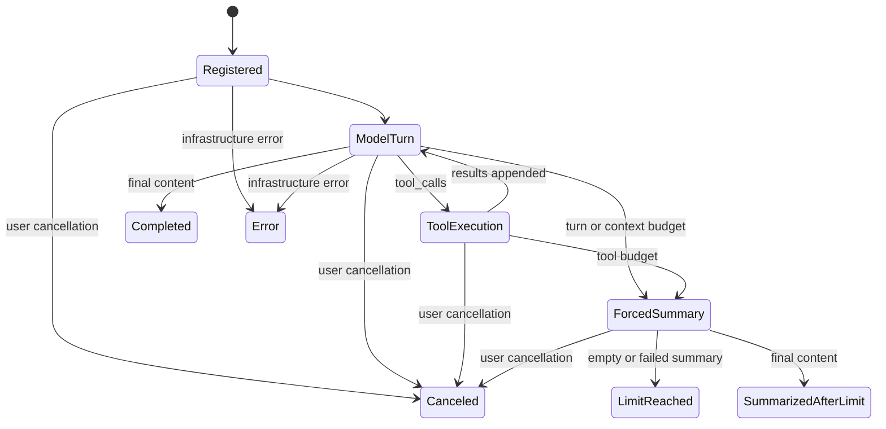

# CoursePilot Agent 运行时演进设计

日期：2026-08-08
状态：四阶段实施完成

## 1. 决策

CoursePilot 不引入 Rig、LangGraph、Swiftide、OpenAI Agents SDK 等新的 Agent 运行时，
也不增加 Node.js 或 Python sidecar。后续只借鉴成熟框架已经验证过的设计模式，并在现有
Rust/Tauri 架构中按产品边界实现。

原因不是排斥框架，而是本项目最难替换的部分不在通用工具循环：

- `llm/agent.rs` 已有流式多轮调用、工具预算、强制总结和可取消工具执行；
- `pipeline/assistant.rs` 持有课程领域工具、真实对象解析和“写操作只生成提案”的安全边界；
- `commands/assistant.rs` 管理 Tauri 请求、取消登记、历史裁剪和最终回复；
- 前端确认卡才拥有写操作和导航动作的最终执行权。

引入完整框架会重做这些边界，却不能替代课程领域逻辑。演进策略因此是：保持现有所有权，
把状态、停止条件、策略、检查点和可观测性逐步显式化。

## 2. 目标与非目标

### 目标

1. 每次 Agent 运行都有唯一、可解释的终态，不能靠多个布尔值组合猜测。
2. 生命周期事件成对且有顺序，取消、预算封顶、总结失败都能被准确观察。
3. 工具执行前后有统一策略入口，领域工具仍负责最终的业务校验。
4. 需要用户介入时形成可序列化检查点；恢复时重新核对外部状态，不复活旧动作。
5. 建立不记录提问正文、模型正文和工具结果的结构化运行日志。
6. 每一阶段都能独立回滚，并由现有回归测试保护。

### 非目标

- 不做多 Agent 自动分工或模型间 handoff。
- 不把课程处理流水线改造成通用工作流引擎。
- 不允许模型绕过确认卡直接修改课程、视频、设置或文件。
- 不把模型思考内容、字幕正文、工具返回正文写入遥测。
- 不改变前端确认卡的 executable payload 和最终执行协议；会话层只增加不可执行检查点。

## 3. 现有边界

| 层 | 责任 | 必须保留的约束 |
| --- | --- | --- |
| `llm/agent.rs` | 模型回合、工具往返、流式事件、预算、取消 | 不认识业务动作，不直接写数据库 |
| `pipeline/assistant.rs` | 工具目录、参数解析、真实对象查询、动作提案 | 写操作只生成 `AssistantAction` |
| `commands/assistant.rs` | 请求生命周期、历史、Tauri 事件、回复装配 | 取消后丢弃动作和未完成轮次 |
| `AssistantPanel` / `AssistantActionCard` | 展示、人工确认、动作执行 | 重启后旧动作失效，执行前再次确认目标 |

任何演进都不能把领域安全规则下沉到通用模型循环，也不能把最终执行权上移给模型。

## 4. 借鉴的设计模式

### 4.1 显式状态与终态

借鉴 LangGraph 的状态图和 Swiftide 的停止条件，但不引入图运行时。一次运行采用以下状态：

第一阶段先引入 `AgentStopReason`：

- `completed`：模型正常给出终答；
- `summarized_after_limit`：工具链封顶后，额外总结成功；
- `canceled`：用户主动停止；
- `limit_reached`：封顶后的总结为空或失败，未得到可靠终答。

基础设施错误仍通过 `AppResult::Err` 和 `AssistantEvent::Error` 返回，不伪装成正常 outcome。
现有 `canceled`、`hit_turn_limit` 暂时保留为兼容字段，但必须由停止原因推导。

### 4.2 生命周期事件

借鉴 Agent SDK 的 run/tool lifecycle：

- 每个 `TurnStarted` 先于该轮的正文和思考增量；
- 每个实际开始的 `ToolStarted` 必须恰好对应一个 `ToolFinished`；
- 被预算拒绝、尚未开始的工具不冒充已执行工具；
- 最终 outcome 是终态事实来源，流式事件只用于过程显示。

不增加通用 hook 列表。只有出现第二个真实消费者时，才把事件观察者抽象成独立 trait。

### 4.3 工具策略与 Guardrail

借鉴 Rig 的类型化工具目录和 Agent SDK 的 guardrail，但保持双层校验：

1. 通用层：工具名存在、调用预算、参数 JSON 可解析、取消状态；
2. 领域层：对象真实存在、课程上下文未过期、动作风险类型、目标解析；
3. 执行层：只读工具可立即执行，导航与写操作只返回待点击/待确认动作；
4. 界面层：用户确认后调用现有 IPC，执行前由命令再次校验当前状态。

未来的工具描述应显式声明 `read_only`、`navigation`、`mutation_proposal`，但不能仅依赖声明
保障安全；真正的实现仍必须做到模型调用工具时不会直接产生写入。

### 4.4 检查点与恢复

借鉴 LangGraph 的 checkpoint/interrupt/resume，但检查点只保存可验证状态，不保存 future、
闭包、访问令牌或可直接执行的旧动作。

检查点候选字段：

- schema 版本、创建时间和失效时间；
- 等待用户介入的动作类别和只用于展示的目标描述；
- 已完成的完整消息组继续由现有有界 history 保存。

阶段 3 最终没有保存 run id、稳定资源 id 或工具能力指纹。当前恢复流程并不直接续跑旧 run，
保存这些字段只会扩大被误当成 executable payload 的机会。检查点明确不保存 URL、文件路径、
设置 key/value、目标资源 id、新标题或跳转时间；恢复所需的真实 id 必须由新一轮领域工具查询。

恢复规则：

1. 旧确认卡的 executable payload 永不恢复；
2. 用户选择继续后，重新调用只读工具查询资源；
3. 根据最新状态生成新的提案和 action id；
4. 目标不存在、已变化或检查点过期时明确终止，不静默换目标。

### 4.5 可观测性

借鉴 OpenAI Agents SDK 的 trace 思路，但只使用项目已有的 `tracing`：

- 开始：`request_id`；
- 结束：`request_id`、停止原因、回合数、工具名列表、动作数量、耗时；
- 错误：`request_id`、错误类别、耗时；
- 禁止记录：用户问题、模型正文、reasoning、工具参数、工具结果和文件路径正文。

日志用于回答“为什么停”“跑了多少轮”“调用了哪些能力”，不用于重放用户数据。

## 5. 分阶段实施

### 阶段 1：类型化终态与最小运行追踪

状态：已完成（`fea8664`）。

- 新增 `AgentStopReason`；
- 所有 `AgentOutcome` 通过统一构造函数生成兼容标志；
- `AssistantReply` 返回停止原因，前端类型先作为兼容可选字段接收；
- 命令层记录无正文的开始、完成和错误日志；
- 为正常完成、封顶后总结、封顶失败和取消补充终态断言。

行为必须保持不变：不新增工具、不修改提示词、不改变动作确认、不改变历史裁剪。

### 阶段 2：工具能力元数据与统一前置策略

状态：已完成。

工具 effect 分为三类：

- `read_only`：允许读取数据库或外部搜索，不得生成任何前端动作；
- `client_action`：只允许生成导航或可逆 UI 动作，包括打开视频、跳转和切换主题；
- `mutation_proposal`：只允许生成待确认提案，不得直接修改数据库或文件。

原计划把第二类称为 `navigation`，但 `set_theme` 会生成可逆前端动作而不是导航。把它硬标为
只读或写操作提案都会掩盖真实行为，因此用更准确的 `client_action` 覆盖二者。

运行时按以下顺序执行：

1. `ToolBox::run` 的统一 preflight 验证工具名已注册；
2. 参数必须是合法 JSON 对象，字段级业务规则仍由领域参数类型校验；
3. 领域 dispatch 查询真实资源并生成结果或动作；
4. postflight 只检查本次调用新增的动作与声明 effect 是否一致；
5. effect 不一致时回滚本次新增动作，并把结构化策略错误作为工具结果返回模型。

未知工具、非法 JSON 和 effect 不一致不能打断整轮 Agent；它们仍是模型可修正的工具结果。
过期课程上下文和不存在的资源继续由领域层查询当前数据库后拒绝，不能由静态元数据代替。

### 阶段 3：人工介入检查点

状态：已完成。

- 定义版本化、不可执行的 `AssistantCheckpoint`；
- 将“等待确认”和“操作已失效”统一为显式交互状态；
- 恢复必须重新查询并生成新动作；
- 增加跨重启、资源已删除、同名资源和过期场景测试。

实现落在现有 `assistantSession` 边界，不增加新的运行时：

- 内存中的非主题动作统一表现为 `awaiting_user`；
- 写入 localStorage 时动作 payload 一律清空，只保存 `version = 1` 的展示检查点；
- 读取时无论落盘状态是什么，都强制转换为不可执行的 `expired`；
- 24 小时内重启标记为 `restart`，超过 24 小时标记为 `timeout`；
- 兼容保留 `actionsExpired`，界面改由统一交互状态判断是否显示失效提示；
- 同名目标按原顺序分别保留展示记录，不按名称推断或合并对象；
- 历史中加入明确约束：如仍需操作，必须重新调用工具核对当前状态并生成新按钮。

### 阶段 4：离线评测与回归门槛

状态：已完成。

- 建立确定性的 scripted-provider 场景集；
- 覆盖查找、导航、删除提案、导入提案、提示注入、取消和预算封顶；
- 记录终态、工具轨迹和动作类型，不比较模型逐字措辞；
- 关键安全场景不通过时禁止扩大 Agent 能力。

评测直接组合现有 `agent::run`、`Provider::Scripted` 和真实 `AssistantTools`，不另建评测运行时。
每个 `EvalSnapshot` 只记录 `stop_reason`、回合数、真正开始执行的工具名、动作类型和工具结果；
数据库断言另行验证删除/导入工具只生成提案，没有提前写入。

当前场景矩阵：

| 场景 | 关键断言 |
| --- | --- |
| 查找课程视频 | `completed`，只调用 `list_videos`，动作为空 |
| 打开视频 | 只产生一个待点击 `open_video` 动作 |
| 删除并导入 | 只产生 `propose_delete` / `propose_import`，原视频仍存在 |
| 学习资料中的提示注入 | 恶意文字确实进入工具结果，但卡片答案不泄露且动作为空 |
| 开始前取消 | `canceled`，0 回合、0 工具、0 动作 |
| 连续调用到上限 | `summarized_after_limit`，只读工具执行次数受限，动作为空 |

这套评测验证执行协议和副作用边界，不评价真实模型的措辞、事实质量或提示遵循概率。后者需要固定
模型版本和单独的数据集，不能伪装成完全确定的单元测试。

## 6. 阶段 1 验收标准

1. 正常终答为 `completed`，兼容标志均为 false。
2. 封顶后总结成功为 `summarized_after_limit`，不能显示“未得出结论”。
3. 总结失败或为空为 `limit_reached`，`hit_turn_limit` 为 true。
4. 任意时刻取消均为 `canceled`，`hit_turn_limit` 为 false，动作列表为空。
5. JSON 中停止原因使用稳定的 snake_case 名称。
6. 日志不包含问题、回答、工具参数或工具结果。
7. 现有 Agent、命令层和 TypeScript 聚焦测试通过。

## 7. 回滚与兼容

- `AgentStopReason` 是新增字段，旧前端会忽略；前端类型暂时可选以兼容旧后端。
- `canceled` 和 `hit_turn_limit` 在确认所有消费者迁移前不删除。
- 阶段 1 不修改数据库 schema，不需要数据迁移。
- 任一阶段出现行为回归，可以只回滚该阶段，不影响动作提案和确认卡协议。

## 8. 后续决策门槛

完成阶段 1 后，只有满足以下条件才进入阶段 2：

- 当前 Agent 聚焦测试全部通过；
- dirty worktree 中无意外覆盖；
- 终态日志能区分正常完成、取消和封顶失败；
- 新抽象至少能消除一个已存在的歧义，而不是为了模仿外部框架增加层级。

## 9. 阶段 2 验收标准

1. 每个模型可见工具恰好有一条 effect 元数据，名称无重复、无遗漏。
2. 未注册工具和非 JSON 对象参数不会进入领域 dispatch。
3. `read_only` 工具不能留下任何 `AssistantAction`。
4. `client_action` 工具只能留下 `OpenVideo`、`SeekTo` 或 `SetTheme`。
5. `mutation_proposal` 工具只能留下 `Propose*` 动作。
6. postflight 发现错配时回滚本次新增动作，不影响此前已经通过策略的动作。
7. 所有写操作仍由现有确认卡执行，数据库 schema、前端动作协议和提示词保持不变。

## 10. 阶段 3 验收标准

1. localStorage 中不保存任何 `AssistantAction` payload。
2. 检查点不包含 URL、路径、资源 id、设置值、新名称或跳转时间。
3. 任意检查点跨重启读取后只能是 `expired`，不能恢复为 `awaiting_user`。
4. 超过 24 小时的检查点明确标记为 `timeout`。
5. 同名目标保持为不同展示记录，但不能凭名称选择可执行对象。
6. 目标已删除或已变化时，旧检查点没有足够参数执行；新请求必须经过领域工具实时查询。
7. `set_theme` 已即时生效，不创建等待介入检查点。
8. 旧版只有 `actionsExpired` 的存储记录仍能恢复并显示失效提示。

## 11. 阶段 4 验收标准

1. 场景不访问真实模型或网络模型端点，结果可重复。
2. 判定基于类型化终态、工具轨迹、动作类型和数据库状态，不比较终答逐字文本。
3. 只读场景不能产生任何 `AssistantAction`。
4. 导航场景只能产生 `client_action`，写操作场景只能产生 `mutation_proposal`。
5. 删除/导入场景必须证明确认前数据库未变化。
6. 来自复习题面等学习资料的指令文本不能自行生成动作，答案字段不能进入工具结果。
7. 取消和预算封顶分别落到 `canceled` 与 `summarized_after_limit`，不能混用兼容布尔值猜测。
8. 扩大 Agent 工具能力前，scripted eval、领域工具测试和通用 Agent 循环测试必须全部通过。
